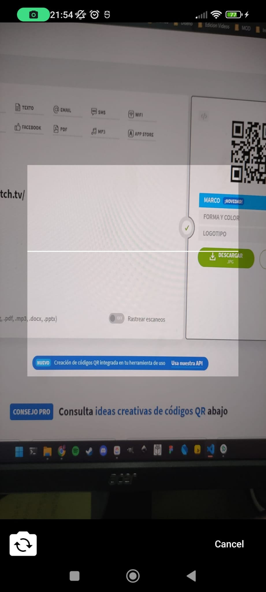
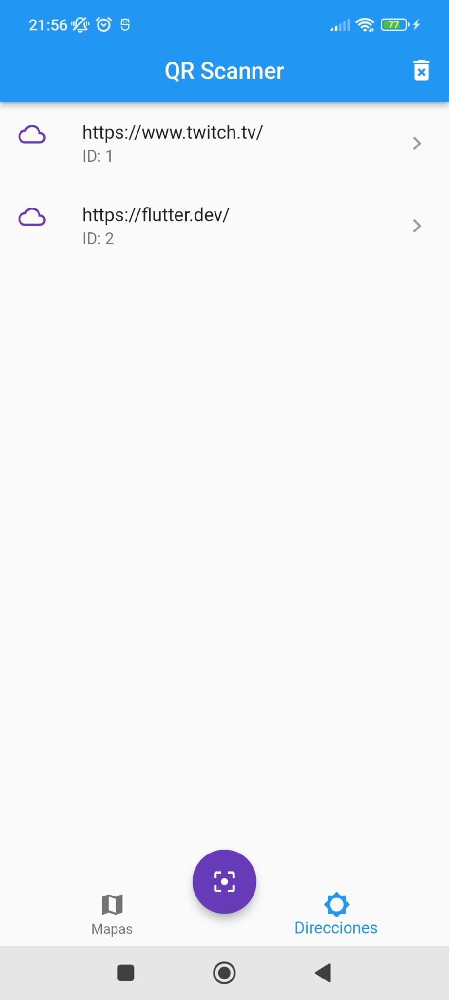
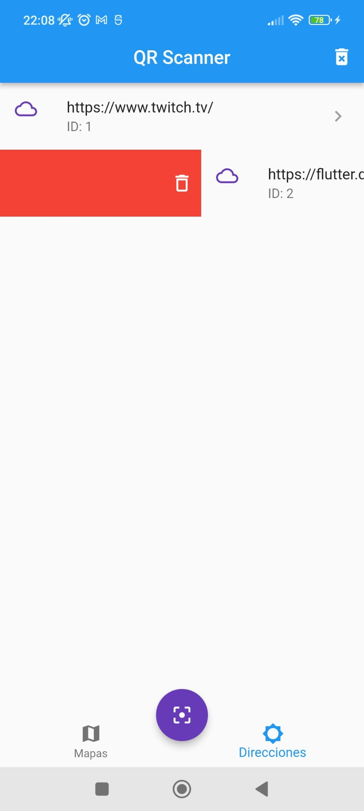
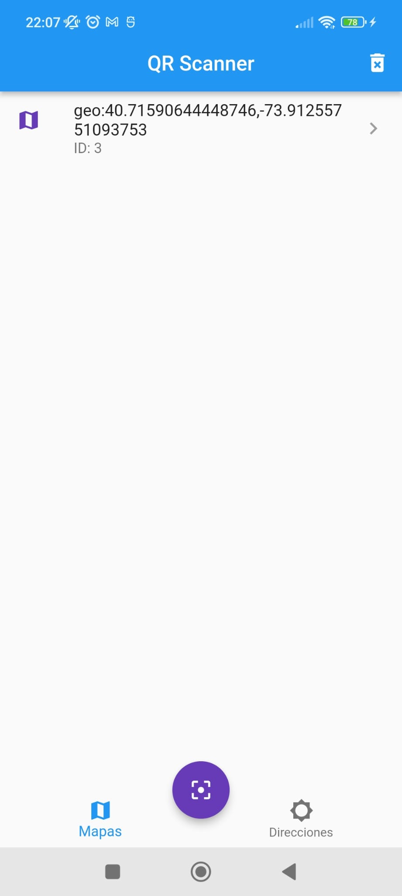
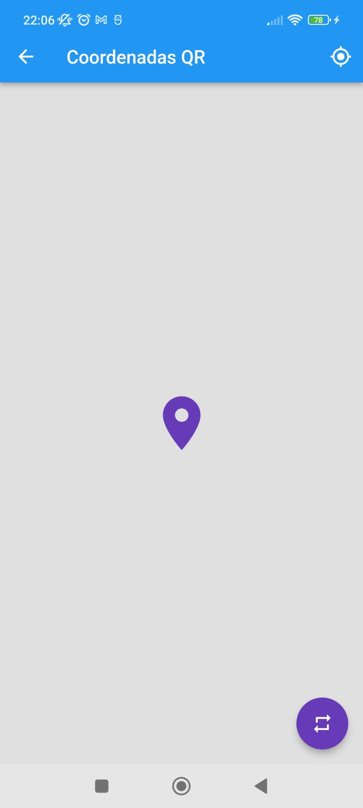

# QrReader App

This is an application that uses the flutter_barcode_scanner package to be able to read QRCodes or Barcodes and read their content. Specifically, this app opens URL links in the browser, but it can be used for more.

It also uses the BLoC pattern for state management and SQFLite to store the value of the codes read.

  
  
  
  
  
  

